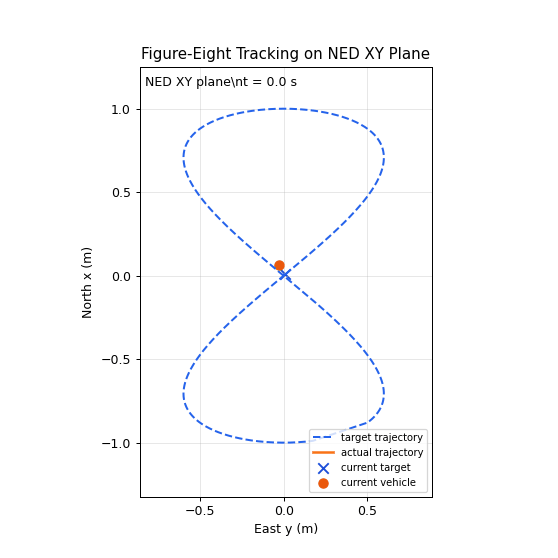

# PX4 ROS 2 SITL 无人机多轨迹 Offboard 跟踪实验框架

基于 PX4 SITL、Gazebo Harmonic、ROS 2 Humble 的无人机 Offboard 仿真控制项目，用于对比 X500 四旋翼对不同轨迹 setpoint 的跟踪效果；当前已完成定点悬停与 8 字轨迹实验，并新增统一多轨迹节点支持 line、square、circle、figure8、z_step 等模式。

## 仿真安全声明

本项目仅用于仿真环境。所有 Offboard 节点、脚本和实验结果均为 simulation-only，不用于真机部署。

## 动态效果：8 字轨迹跟踪

下面的 GIF 由 `logs/figure8_first_success.csv` 离线生成，展示目标轨迹与实际轨迹在 NED XY 平面上的推进过程，不是重新录屏或重新运行 Gazebo。



## 核心结果

PX4 local position 使用 NED 坐标系，`z` 轴向下，因此 `z=-2.0` 表示向上约 2 m。

| 实验 | 控制目标 | 关键结果 |
| --- | --- | --- |
| 定点悬停 | NED `(0, 0, -2)` | 稳态 z RMSE `0.0864 m`，XY RMSE `0.0313 m`，最终位置误差 `0.0327 m` |
| 8 字轨迹 | `x=sin(t)`, `y=sin(2t)`, `z=-2`，跟踪 `40.000 s` | XY RMSE `0.2003 m`，z RMSE `0.1944 m`，3D RMSE `0.2791 m` |

详细指标见：

- [results/summary_metrics.md](results/summary_metrics.md)
- [results/offboard_hover_metrics.md](results/offboard_hover_metrics.md)
- [results/figure8_metrics.md](results/figure8_metrics.md)
- [results/trajectory_suite_metrics.md](results/trajectory_suite_metrics.md)

## 支持的轨迹模式

| 轨迹 | 状态 | 说明 |
| --- | --- | --- |
| `hover` | 已完成实测 | 固定 NED `(0, 0, -2)` 悬停 |
| `figure8` | 已完成实测 | 8 字轨迹 CSV 已分析 |
| `line` | 节点已支持，待运行实验 | x 方向平滑往返 |
| `square` | 节点已支持，待运行实验 | 四角点循环插值 |
| `circle` | 节点已支持，待运行实验 | 圆轨迹 setpoint |
| `z_step` | 节点已支持，待运行实验 | 高度阶跃/平滑响应测试 |

统一节点：

```bash
ros2 run px4_offboard_lab offboard_trajectory --ros-args -p trajectory:=circle -p controller_mode:=baseline
```

## 控制模式对比实验计划

本项目不改 PX4 内部飞控。PX4 仍负责位置、速度、姿态和角速度闭环控制；本项目只在 ROS 2 Offboard 外层改进轨迹 setpoint 的生成方式。

| 控制模式 | 定义 | 状态 |
| --- | --- | --- |
| `baseline` | position-only setpoint，velocity/acceleration 为 NaN | 已实现 |
| `feedforward` | position + velocity feedforward，acceleration 暂为 NaN | 已实现，待成对实验 |
| `smooth` | 平滑轨迹 / 拐角减速 + velocity feedforward | 已实现，待成对实验 |

计划对比：

- `circle baseline` vs `circle feedforward`
- `figure8 baseline` vs `figure8 feedforward`
- `square baseline` vs `square smooth`
- `line baseline` vs `line smooth`
- `z_step baseline` vs `z_step smooth`

当前还没有完整成对控制对比实验结果，因此 README Results 不提前宣称误差下降。详细说明见 [docs/control_improvement.md](docs/control_improvement.md)。

## 项目亮点

- 搭建 PX4 SITL + Gazebo Harmonic X500 四旋翼仿真环境。
- 使用 Micro XRCE-DDS Agent 打通 PX4 与 ROS 2 `/fmu/...` 话题桥接。
- 实现 ROS 2 Python Offboard 节点，按 20 Hz 发布 setpoint，并在切入 OFFBOARD 前进行 setpoint warm-up。
- 新增统一多轨迹节点 `offboard_trajectory`，支持 `hover`、`line`、`square`、`circle`、`figure8`、`z_step`。
- 记录 CSV 日志，生成 JSON / Markdown 指标、PNG 图表和 GIF 动态可视化。
- 不提交 PX4-Autopilot、ULog 大文件和构建产物，仓库保持轻量、可复现。

## 方法流程

完整流程图见 [results/project_pipeline.md](results/project_pipeline.md)。

```text
Windows / WSL2 Ubuntu
-> PX4 SITL + Gazebo Harmonic X500
-> Micro XRCE-DDS Agent
-> ROS 2 Humble + px4_msgs + px4_ros_com
-> ROS 2 Offboard trajectory nodes
-> CSV logs
-> analysis scripts
-> metrics / figures / GIF / README
```

## 结果图精选


完整图表见 [results/README.md](results/README.md)。

## 如何观看仿真无人机运动

按下面顺序分别启动：

1. 打开 QGroundControl，或确保 SITL preflight checks 已解决。
2. 终端 1 启动 Agent：

```bash
MicroXRCEAgent udp4 -p 8888
```

3. 终端 2 启动 PX4 SITL + Gazebo：

```bash
cd ~/src/PX4-Autopilot
make px4_sitl gz_x500
```

4. 终端 3 运行轨迹节点：

```bash
bash scripts/run_trajectory.sh circle baseline
```

可选轨迹：`hover`、`line`、`square`、`circle`、`figure8`、`z_step`。可选控制模式：`baseline`、`feedforward`、`smooth`。

## 如何截图和录屏

截图、录屏和媒体文件管理见 [docs/visual_recording.md](docs/visual_recording.md)。

建议录制：

- `circle_gazebo_demo`
- `square_gazebo_demo`
- `figure8_gazebo_demo`

GIF 可以来自 CSV 离线生成，Gazebo 视频用于展示真实仿真画面。

## 快速复现

详细环境说明见 [docs/reproducibility.md](docs/reproducibility.md)。下面只保留核心命令。

### 构建 ROS 2 Package

```bash
cd ~/px4_ros2_ws
source /opt/ros/humble/setup.bash
source install/setup.bash || true
colcon build --symlink-install
source install/setup.bash
ros2 pkg executables px4_offboard_lab
```

### 运行 Hover / Figure-Eight / Multi-Trajectory

```bash
bash scripts/run_offboard_hover.sh
bash scripts/run_figure8.sh
bash scripts/run_trajectory.sh circle baseline
bash scripts/run_trajectory.sh circle feedforward
bash scripts/run_trajectory.sh square smooth
```

这些脚本不会自动启动 PX4、Gazebo 或 Micro XRCE-DDS Agent。

### 运行离线分析

不需要重新运行 PX4 或 Gazebo，可直接从已提交 CSV 复现实验图表：

```bash
bash scripts/analyze_all.sh
python3 analysis/generate_gifs.py
```

## 项目结构

```text
px4-ros2-sitl-lab/
├── analysis/              # 离线分析、汇总图和 GIF 生成脚本
├── docs/                  # 环境、Offboard、轨迹和复现说明
├── logs/                  # 轻量 CSV 实验日志
├── media/                 # GIF 可视化产物与录屏说明
├── notes/                 # 实验记录与 troubleshooting
├── results/               # 指标、图表和项目级汇总
├── ros2/px4_offboard_lab/ # ROS 2 Offboard package 源码副本
└── scripts/               # SITL 运行脚本和离线分析入口
```

更完整说明见 [docs/project_structure.md](docs/project_structure.md)。

## 数据与可视化产物

- Hover CSV: [logs/offboard_hover_first_success.csv](logs/offboard_hover_first_success.csv)
- Figure-eight CSV: [logs/figure8_first_success.csv](logs/figure8_first_success.csv)
- 指标与图表: [results/](results/)
- 动态可视化: [media/figure8_tracking.gif](media/figure8_tracking.gif)

`logs/ulg/*.ulg` 为本地 PX4 ULog 二进制日志，默认不提交。PX4-Autopilot 和 ROS 2 workspace 也不放入本仓库。

## 局限性

- 仅完成 SITL 仿真验证，未做真机部署。
- 当前已实际跑过并分析的是 hover 与 figure-eight；line、square、circle、z_step 是新增支持模式，仍需后续实测。
- 8 字结果来自一次受控仿真实验，不是鲁棒性 benchmark。
- 指标受 PX4 参数、Gazebo 仿真环境、Offboard 控制参数、QGroundControl / failsafe 状态影响。

## 中文简历表述

- 搭建 PX4 SITL + Gazebo Harmonic + ROS 2 Humble 无人机仿真平台，完成 Micro XRCE-DDS Agent 与 PX4 `/fmu/...` 话题桥接验证。
- 基于 ROS 2 Python 实现 20 Hz Offboard 多轨迹控制节点，支持定点悬停、直线、方形、圆形、8 字和高度阶跃轨迹 setpoint。
- 设计 CSV 日志记录与离线误差分析流程，完成 hover 与 8 字轨迹实测分析，输出 RMSE 指标、PNG 图表和 GIF 动态展示。
