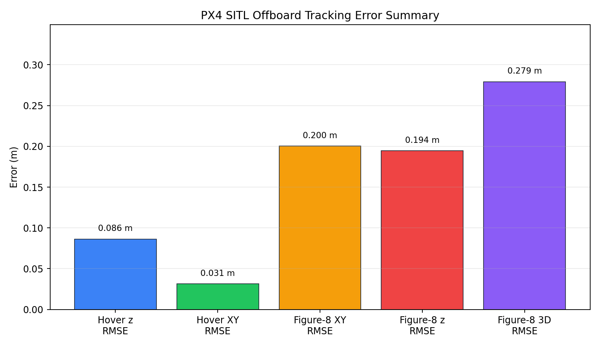
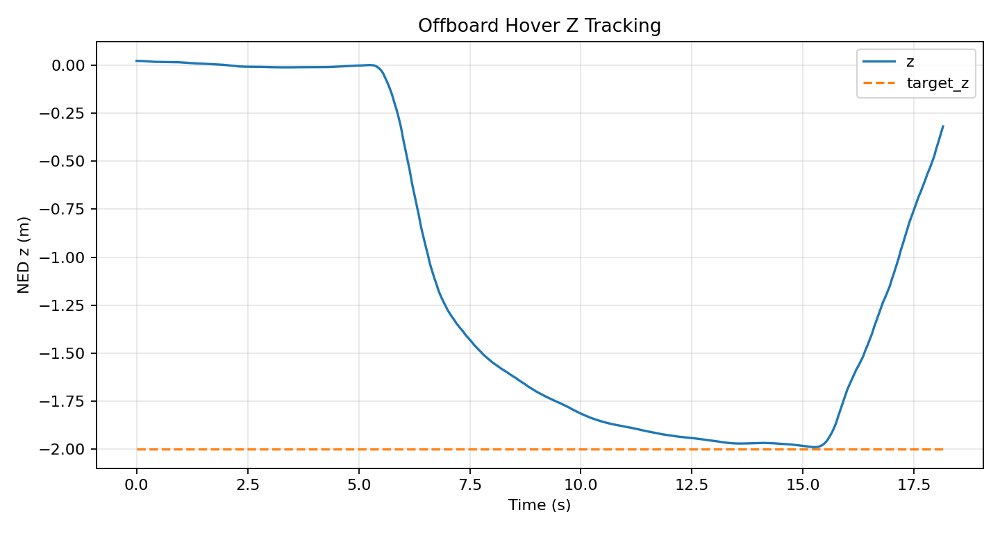
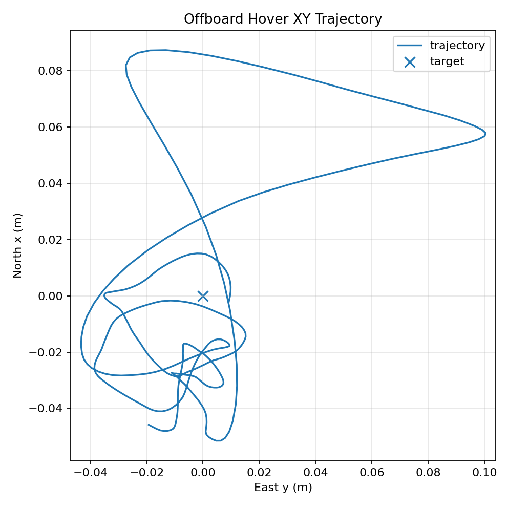
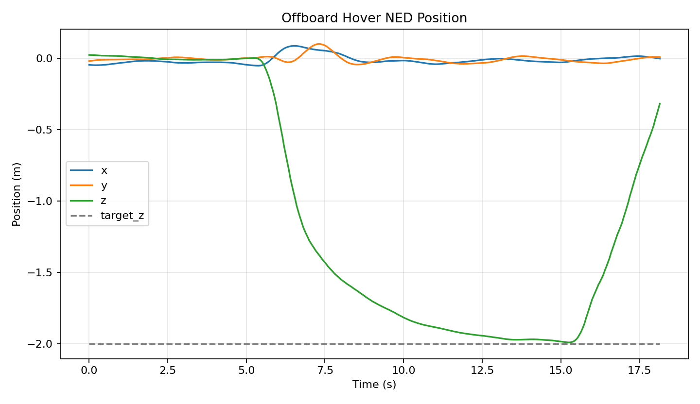
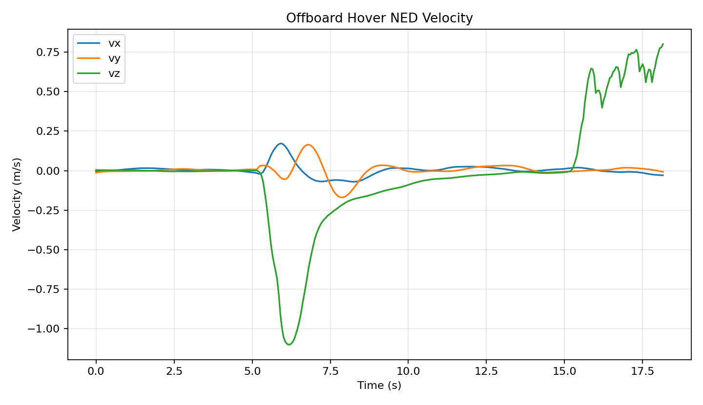
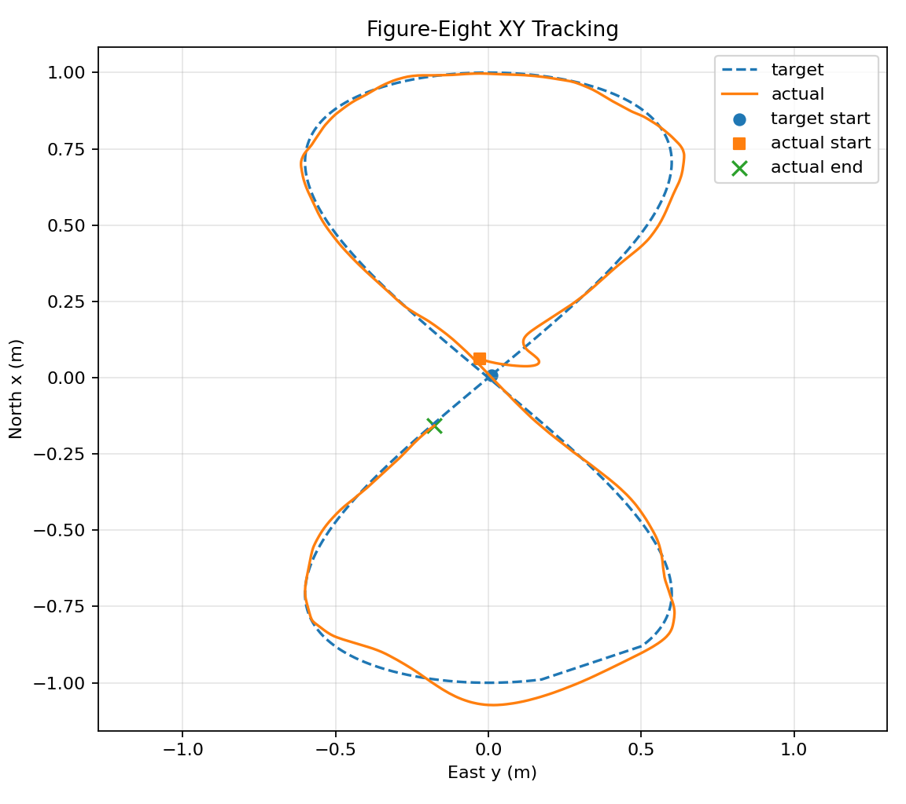
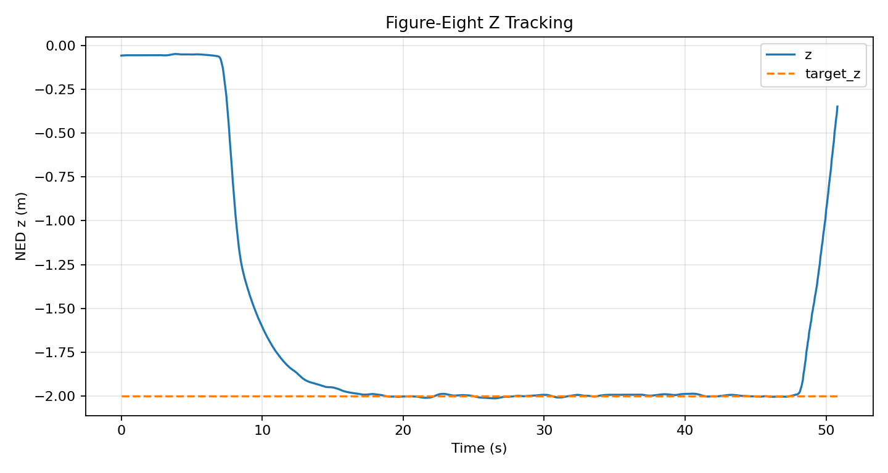
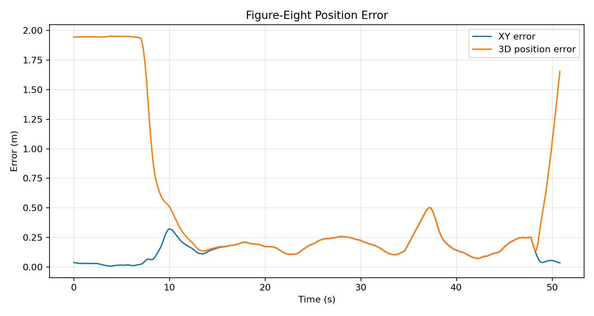
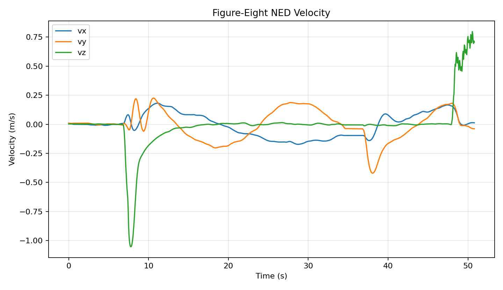

# Results

本目录保存 PX4 SITL Offboard 实验的轻量、可复现分析结果，包括 Markdown 指标、JSON/CSV 汇总和 PNG 图表。

## 项目级汇总

生成命令：

```bash
python analysis/generate_summary_visuals.py
```

输出：

- `results/summary_metrics.md`
- `results/summary_metrics.json`
- `results/summary_metrics.csv`
- `results/figures/metrics_summary.png`
- `results/project_pipeline.md`

项目级汇总优先读取已有分析 JSON，不改变 hover 或 figure-eight 的原始分析逻辑。



## Trajectory Suite Analysis

The suite analyzer is intended for comparing multiple trajectory modes after future runs:

```bash
python analysis/analyze_trajectory_suite.py
```

It scans:

- `logs/trajectory_*.csv`
- `logs/offboard_trajectory_*.csv`
- `logs/figure8_first_success.csv`

Outputs:

- `results/trajectory_suite_metrics.csv`
- `results/trajectory_suite_metrics.json`
- `results/trajectory_suite_metrics.md`
- `results/figures/trajectory_suite_metrics.png`

At the moment, committed measured results include hover and figure-eight. The new unified node also supports line, square, circle, and z_step, but those modes should not be reported as completed until their SITL CSV logs are captured and analyzed.

## Control Mode Comparison

The control comparison analyzer is for paired baseline vs improved experiments:

```bash
python analysis/compare_control_modes.py
```

It scans only logs that explicitly include `controller_mode` and match:

- `logs/offboard_trajectory_*_baseline_*.csv`
- `logs/offboard_trajectory_*_feedforward_*.csv`
- `logs/offboard_trajectory_*_smooth_*.csv`

Outputs:

- `results/control_comparison_metrics.csv`
- `results/control_comparison_metrics.json`
- `results/control_comparison_metrics.md`
- `results/figures/control_comparison_xy_rmse.png`
- `results/figures/control_comparison_3d_rmse.png`
- `results/figures/control_comparison_percent_improvement.png`

If paired logs are missing, the script exits normally and reports that paired SITL experiments should be run first. Existing hover and figure-eight result files are not reclassified as feedforward or smooth results.

## Hover Analysis

输入 CSV：

- `logs/offboard_hover_first_success.csv`

生成命令：

```bash
python analysis/analyze_offboard_hover.py
```

输出：

- `results/offboard_hover_metrics.json`
- `results/offboard_hover_metrics.md`
- `results/figures/offboard_hover_z.png`
- `results/figures/offboard_hover_xy.png`
- `results/figures/offboard_hover_ned_position.png`
- `results/figures/offboard_hover_velocity.png`

关键结果：

- Steady-state hover definition: `stage == "hover" and z <= -1.8`
- Steady-state z RMSE: `0.0864 m`
- Steady-state XY RMSE: `0.0313 m`
- Steady-state final position error: `0.0327 m`

完整 hover 图表：









## Figure-Eight Analysis

输入 CSV：

- `logs/figure8_first_success.csv`

生成命令：

```bash
python analysis/analyze_figure8.py
```

输出：

- `results/figure8_metrics.json`
- `results/figure8_metrics.md`
- `results/figures/figure8_xy_tracking.png`
- `results/figures/figure8_z_tracking.png`
- `results/figures/figure8_position_error.png`
- `results/figures/figure8_velocity.png`

Tracking-stage filter:

```text
stage == "figure8"
```

关键结果：

- Tracking duration: `40.000 s`
- XY RMSE: `0.2003 m`
- z RMSE: `0.1944 m`
- 3D position RMSE: `0.2791 m`
- Max 3D position error: `1.3506 m`
- Final position error before landing: `0.2492 m`

完整 figure-eight 图表：









## Media

生成命令：

```bash
python analysis/generate_gifs.py
```

输出：

- `media/figure8_tracking.gif`

GIF 由 `logs/figure8_first_success.csv` 离线生成，展示 NED XY 平面上的目标轨迹和实际轨迹。它不依赖重新运行 PX4 或 Gazebo。

## 说明

Hover 是固定点跟踪，figure-eight 是时变 XY 轨迹跟踪。两者均为 PX4 SITL 仿真结果，使用 ROS 2 Offboard setpoint 通过 PX4 `/fmu/in/...` 话题发送控制输入。
