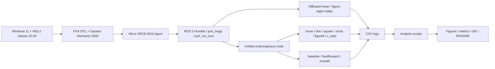

# Project Pipeline

```mermaid
flowchart LR
  A["Windows 11 + WSL2 Ubuntu 22.04"] --> B["PX4 SITL + Gazebo Harmonic X500"]
  B --> C["Micro XRCE-DDS Agent"]
  C --> D["ROS 2 Humble / px4_msgs / px4_ros_com"]
  D --> E["Offboard hover / figure-eight nodes"]
  D --> F["Unified multi-trajectory node"]
  F --> G["hover / line / square / circle / figure8 / z_step"]
  F --> K["baseline / feedforward / smooth"]
  E --> H["CSV logs"]
  G --> H
  K --> H
  H --> I["Analysis scripts"]
  I --> J["Figures / metrics / GIF / README"]
```

The repository stores the project code, lightweight CSV logs, generated figures, and summary metrics. PX4-Autopilot and the ROS 2 workspace remain external dependencies.
